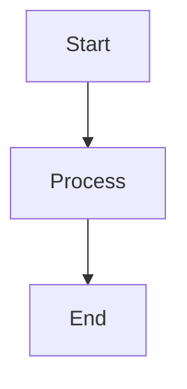

import {Aside} from "@astrojs/starlight/components";

## HTTP là gì?

**HTTP** là một giao thức truyền thông tầng ứng dụng dựa trên TCP/IP, chuẩn hóa cách mà máy khách và máy chủ giao tiếp với nhau.

Nó định nghĩa cách nội dung được yêu cầu và truyền tải qua internet. Giao thức tầng ứng dụng có nghĩa là nó chỉ là một lớp trừu tượng chuẩn hóa cách các máy chủ (máy khách và máy chủ) giao tiếp.

Bản thân HTTP phụ thuộc vào **TCP/IP** để truyền yêu cầu và phản hồi giữa máy khách và máy chủ. Theo mặc định, cổng **TCP 80** được sử dụng, nhưng các cổng khác cũng có thể được dùng.

<Aside>
    **HTTPS thì sử dụng cổng 443**.
</Aside>

---

## Sự phát triển

### HTTP/0.9 - (1991)

Phiên bản được ghi nhận đầu tiên của HTTP là HTTP/0.9, được đề xuất vào năm 1991. Đây là giao thức đơn giản nhất từ trước đến nay, chỉ có một phương thức duy nhất là `GET`.

Nếu một máy khách muốn truy cập một trang web trên máy chủ, nó sẽ gửi một yêu cầu đơn giản như sau:

```http request
GET /index.html
```

Và phản hồi từ máy chủ sẽ trông như sau:

```http request
(nội dung phản hồi)
(kết nối đóng)
```

Tức là, máy chủ sẽ nhận yêu cầu, trả về HTML trong phản hồi và ngay khi nội dung được truyền xong, kết nối sẽ được đóng. Đặc điểm của HTTP/0.9 bao gồm:

- Không có tiêu đề (header)
- `GET` là phương thức duy nhất
- Phản hồi phải là HTML

Giao thức này thực sự chỉ là một bước đệm cho những gì sắp tới.

### HTTP/1.0 - 1996

Năm 1996, phiên bản tiếp theo của HTTP, tức là **HTTP/1.0**, ra đời với nhiều cải tiến đáng kể so với phiên bản ban đầu.

Không giống như **HTTP/0.9**, vốn chỉ được thiết kế cho phản hồi HTML, HTTP/1.0 giờ đây có thể xử lý các định dạng phản hồi khác như:

- Hình ảnh
- Tệp video,
- Văn bản thuần túy
- Hoặc bất kỳ loại nội dung nào khác.

Phiên bản này bổ sung thêm
- Các phương thức (như `POST` và `HEAD`), định dạng yêu cầu/phản hồi được thay đổi
- Tiêu đề HTTP (header) được thêm vào cả yêu cầu & phản hồi
- Mã trạng thái (status code) được thêm để xác định phản hồi,
- Hỗ trợ bộ ký tự được giới thiệu, cùng với các loại đa phần, ủy quyền, bộ nhớ đệm, mã hóa nội dung và nhiều tính năng khác.

Dưới đây là ví dụ về một yêu cầu và phản hồi HTTP/1.0

```http request
GET / HTTP/1.0
Host: localhost:4321
User-Agent: Mozilla/5.0 (X11; Linux x86_64; rv:139.0) Gecko/20100101 Firefox/139.0
Accept: */*
```

Như bạn thấy, cùng với yêu cầu, máy khách cũng đã gửi thông tin cá nhân của nó, loại phản hồi yêu cầu, v.v.

Trong khi đó, ở **HTTP/0.9**, máy khách không thể gửi các thông tin như vậy vì không có tiêu đề (header).

Ví dụ phản hồi cho yêu cầu trên có thể trông như sau:

```http request
HTTP/1.0 200 OK
Content-Type: text/plain
Content-Length: 137582
Expires: Thu, 07 Dec 1997 16:00:00 GMT
Last-Modified: Wed, 11 August 1996 15:55:28 GMT
Server: Apache 0.84

(nội dung phản hồi)
(kết nối đóng)
```

Ở đầu phản hồi, có **HTTP/1.0 (HTTP kèm theo số phiên bản)**, sau đó là mã trạng thái `200` kèm theo cụm từ lý do (hoặc mô tả về mã trạng thái).

Trong phiên bản mới này, tiêu đề yêu cầu và phản hồi vẫn được mã hóa dưới dạng ASCII, nhưng phần nội dung phản hồi có thể thuộc bất kỳ loại nào, như hình ảnh, video, HTML, văn bản thuần túy hoặc bất kỳ loại nội dung nào khác. Vì vậy, giờ đây máy chủ có thể gửi bất kỳ loại nội dung nào đến máy khách; không lâu sau khi được giới thiệu, thuật ngữ **"Hyper Text"** trong HTTP đã không còn hoàn toàn chính xác nữa. **HMTP** hoặc Giao thức truyền tải siêu phương tiện có lẽ sẽ hợp lý hơn, nhưng có lẽ chúng ta sẽ mãi gắn bó với cái tên **HTTP** quen thuộc.

Một trong những hạn chế lớn của **HTTP/1.0** là không thể thực hiện nhiều yêu cầu trên một kết nối. Tức là, mỗi khi máy khách cần lấy dữ liệu từ máy chủ, nó phải mở một kết nối TCP mới, và sau khi yêu cầu đó được hoàn thành, kết nối sẽ bị đóng. Bất kỳ yêu cầu tiếp theo nào cũng phải thực hiện trên một kết nối mới. Tại sao điều này không tốt? Hãy tưởng tượng bạn truy cập một trang web có 10 hình ảnh, 5 tệp CSS và 5 tệp JavaScript, tổng cộng 20 mục cần tải khi gửi yêu cầu đến trang web đó. Vì máy chủ đóng kết nối ngay sau khi yêu cầu được hoàn thành, sẽ có một chuỗi 20 kết nối riêng biệt, mỗi mục sẽ được phục vụ từng cái một trên các kết nối riêng. Số lượng kết nối lớn này dẫn đến giảm hiệu suất nghiêm trọng, vì việc yêu cầu một kết nối TCP mới gây ra một điểm yếu lớn về hiệu suất do **quá trình bắt tay ba bước (three-way handshake)** và khởi động chậm (slow-start).

### Bắt tay ba bước (Three-way Handshake)

Bắt tay ba bước, ở dạng đơn giản nhất, là quá trình mà tất cả các kết nối TCP bắt đầu bằng cách máy khách và máy chủ trao đổi một chuỗi ba gói tin trước khi bắt đầu chia sẻ dữ liệu ứng dụng.

1. **SYN**: Máy khách chọn một số ngẫu nhiên, giả sử là `x`, và gửi nó đến máy chủ.
2. **SYN-ACK**: Máy chủ xác nhận yêu cầu bằng cách gửi lại một gói tin ACK cho máy khách. Gói tin này bao gồm một số ngẫu nhiên `y` do máy chủ chọn, và `x + 1` để xác nhận SYN từ máy khách.
3. **ACK**: Máy khách tăng số `y` nhận được từ máy chủ lên một đơn vị và gửi lại một gói tin ACK với số `y + 1`.

Khi quá trình bắt tay ba bước hoàn tất, việc chia sẻ dữ liệu giữa máy khách và máy chủ có thể bắt đầu. Cần lưu ý rằng máy khách có thể bắt đầu gửi dữ liệu ứng dụng ngay sau khi gửi gói tin ACK cuối cùng, nhưng máy chủ vẫn phải **đợi nhận được gói tin ACK này** để thực hiện yêu cầu.

```text
| Máy khách |                               | Máy chủ |
       |                                          |
       | -------- SYN: x = rand() ------------->  |
       |                                          |
       | <--- SYN-ACK: x + 1, y = rand() -------  |
       |                                          |
       | -------- ACK: y + 1 ------------------>  |
       |                                          |
       | ---- Application Data (GET /...) ---->   |
```
Tuy nhiên, một số triển khai của HTTP/1.0 đã cố gắng khắc phục vấn đề này bằng cách giới thiệu một tiêu đề mới gọi là `Connection: keep-alive`, nhằm thông báo với máy chủ rằng: "Này máy chủ, đừng đóng kết nối này, tôi sẽ cần dùng lại." Tuy nhiên, tính năng này vẫn không được hỗ trợ rộng rãi và vấn đề vẫn tồn tại.

Ngoài việc không duy trì kết nối, HTTP còn là một giao thức không trạng thái (stateless), tức là máy chủ không lưu giữ thông tin về máy khách, do đó mỗi yêu cầu phải chứa đầy đủ thông tin cần thiết để máy chủ xử lý yêu cầu một cách độc lập, không liên quan đến các yêu cầu trước đó. Điều này càng làm trầm trọng thêm vấn đề, tức là ngoài việc máy khách phải mở một số lượng lớn kết nối, nó còn phải gửi một số dữ liệu dư thừa qua mạng, dẫn đến tăng mức sử dụng băng thông.

### **HTTP/1.1 - 1997**

Chỉ sau 3 năm kể từ **HTTP/1.0**, phiên bản tiếp theo, tức là **HTTP/1.1**, được phát hành vào năm 1999, mang đến nhiều cải tiến vượt trội so với phiên bản trước. Những cải tiến chính so với HTTP/1.0 bao gồm:

1. **Thêm các phương thức HTTP mới**: Các phương thức như `PUT`, `PATCH`, `OPTIONS`, `DELETE` được giới thiệu.

2. **Xác định tên máy chủ (Hostname Identification)**: Trong HTTP/1.0, tiêu đề Host không bắt buộc, nhưng HTTP/1.1 đã yêu cầu bắt buộc phải có tiêu đề này.

3. **Kết nối liên tục (Persistent Connections)**: Như đã thảo luận, trong HTTP/1.0, mỗi kết nối chỉ xử lý một yêu cầu và kết nối sẽ bị đóng ngay sau khi yêu cầu được hoàn thành, dẫn đến vấn đề về hiệu suất và độ trễ. HTTP/1.1 giới thiệu kết nối liên tục, tức là kết nối không bị đóng theo mặc định mà được giữ mở, cho phép thực hiện nhiều yêu cầu liên tiếp. Để đóng kết nối, tiêu đề `Connection: close` phải được bao gồm trong yêu cầu. Máy khách thường gửi tiêu đề này trong yêu cầu cuối cùng để đóng kết nối một cách an toàn.

4. **Hàng đợi (Pipelining)**: HTTP/1.1 cũng hỗ trợ hàng đợi, cho phép máy khách gửi nhiều yêu cầu đến máy chủ mà không cần đợi phản hồi từ máy chủ trên cùng một kết nối, và máy chủ phải gửi phản hồi theo đúng thứ tự nhận yêu cầu. Bạn có thể thắc mắc, làm sao máy khách biết được khi nào phản hồi đầu tiên hoàn tất và nội dung cho phản hồi tiếp theo bắt đầu? Để giải quyết vấn đề này, tiêu đề `Content-Length` phải có mặt, giúp máy khách xác định điểm kết thúc của phản hồi và bắt đầu chờ phản hồi tiếp theo.

> Cần lưu ý rằng để tận dụng lợi ích của kết nối liên tục hoặc hàng đợi, tiêu đề `Content-Length` phải có trong phản hồi, vì điều này cho phép máy khách biết khi nào việc truyền dữ liệu hoàn tất để gửi yêu cầu tiếp theo (theo cách gửi yêu cầu tuần tự thông thường) hoặc bắt đầu chờ phản hồi tiếp theo (khi hàng đợi được kích hoạt).
>
> Tuy nhiên, vẫn tồn tại một vấn đề với cách tiếp cận này. Nếu dữ liệu là động (dynamic) và máy chủ không thể xác định độ dài nội dung trước, thì sao? Trong trường hợp đó, bạn thực sự không thể tận dụng kết nối liên tục. Để giải quyết vấn đề này, HTTP/1.1 giới thiệu mã hóa phân khối (chunked encoding). Trong những trường hợp như vậy, máy chủ có thể bỏ qua `Content-Length` và sử dụng mã hóa phân khối (sẽ được giải thích thêm sau). Tuy nhiên, nếu cả hai không có, kết nối phải được đóng sau khi yêu cầu hoàn tất.

**Truyền tải phân khối (Chunked Transfers)**
Trong trường hợp nội dung động, khi máy chủ không thể xác định `Content-Length` ngay từ đầu, nó có thể bắt đầu gửi nội dung theo từng phần (chunk by chunk) và thêm `Content-Length` cho mỗi phần khi gửi. Khi tất cả các phần được gửi đi, tức là toàn bộ quá trình truyền tải hoàn tất, máy chủ gửi một phần rỗng (empty chunk) với `Content-Length` được đặt là 0 để thông báo cho máy khách rằng quá trình truyền tải đã hoàn tất. Để thông báo cho máy khách về truyền tải phân khối, máy chủ bao gồm tiêu đề `Transfer-Encoding: chunked`.

**So với HTTP/1.0**, vốn chỉ có xác thực cơ bản (Basic authentication), HTTP/1.1 đã bổ sung xác thực digest và xác thực proxy, cùng với các tính năng khác như:
- Caching
- Byte Ranges
- Character sets
- Language negotiation
- Client cookies
- Enhanced compression support
- New status codes
- Và nhiều tính năng khác

Xem thêm [Sự khác biệt chính giữa HTTP/1.0 và HTTP/1.1](https://www.ra.ethz.ch/cdstore/www8/data/2136/pdf/pd1.pdf)

HTTP/1.1 được giới thiệu vào năm 1999 và đã trở thành tiêu chuẩn trong nhiều năm. Mặc dù nó cải thiện rất nhiều so với phiên bản trước, nhưng khi web thay đổi hàng ngày, HTTP/1.1 bắt đầu bộc lộ những hạn chế. Việc tải một trang web ngày nay đòi hỏi nhiều tài nguyên hơn bao giờ hết. Một trang web đơn giản hiện nay phải mở hơn 30 kết nối.

Bạn có thể thắc mắc, HTTP/1.1 đã có kết nối liên tục, vậy tại sao vẫn cần nhiều kết nối như vậy? Lý do là, trong HTTP/1.1, chỉ có thể có một kết nối đang chờ xử lý tại bất kỳ thời điểm nào. HTTP/1.1 đã cố gắng khắc phục điều này bằng cách giới thiệu hàng đợi (pipelining), nhưng nó không giải quyết triệt để vấn đề do hiện tượng **head-of-line blocking**, khi một yêu cầu chậm hoặc nặng có thể chặn các yêu cầu phía sau, và một khi yêu cầu bị kẹt trong hàng đợi, nó phải đợi các yêu cầu tiếp theo được hoàn thành. Để khắc phục những hạn chế của HTTP/1.1, các nhà phát triển đã bắt đầu triển khai các giải pháp tạm thời, chẳng hạn như sử dụng spritesheets, mã hóa hình ảnh trong CSS, các tệp CSS/JavaScript khổng lồ, phân mảnh tên miền (domain sharding), v.v.

### **SPDY - 2009**

Google đã tiên phong thử nghiệm các giao thức thay thế để tăng tốc độ web, cải thiện bảo mật và giảm độ trễ của các trang web. Vào năm 2009, họ công bố SPDY.

> SPDY là thương hiệu của Google và không phải là viết tắt của bất kỳ từ nào.

Người ta nhận thấy rằng nếu cứ **tăng băng thông**, hiệu suất mạng sẽ tăng ở giai đoạn đầu, nhưng đến một thời điểm, hiệu suất không còn cải thiện đáng kể. Tuy nhiên, nếu **giảm độ trễ**, hiệu suất mạng sẽ liên tục được cải thiện. Đây là ý tưởng cốt lõi đằng sau việc tăng hiệu suất của SPDY: giảm độ trễ để nâng cao hiệu suất mạng.

- **Độ trễ (latency)** là thời gian trễ, tức là thời gian cần để dữ liệu di chuyển từ nguồn đến đích (tính bằng mili giây).
- **Băng thông (bandwidth)** là lượng dữ liệu được truyền mỗi giây (bit/giây).

Các tính năng của SPDY bao gồm ghép kênh (multiplexing), nén (compression), ưu tiên (prioritization), bảo mật (security), v.v. Ở phần này sẽ không đi sâu vào chi tiết của SPDY, vì bạn sẽ hiểu rõ hơn khi chúng ta tìm hiểu chi tiết về HTTP/2 ở phần tiếp theo, bởi HTTP/2 được lấy cảm hứng chủ yếu từ SPDY.

SPDY không thực sự cố gắng thay thế HTTP; nó là một lớp chuyển đổi (translation layer) hoạt động trên HTTP ở tầng ứng dụng, sửa đổi yêu cầu trước khi gửi qua mạng. SPDY dần trở thành tiêu chuẩn thực tế và đa số trình duyệt bắt đầu hỗ trợ nó.

Vào năm 2015, Google không muốn duy trì hai tiêu chuẩn cạnh tranh, vì vậy họ quyết định tích hợp SPDY vào HTTP, tạo ra HTTP/2 và ngừng sử dụng SPDY.

### **HTTP/2 - 2015**

Đến thời điểm này, bạn hẳn đã hiểu tại sao cần một phiên bản mới của giao thức HTTP. **HTTP/2** được thiết kế để truyền tải nội dung với độ trễ thấp.

Các tính năng chính hoặc khác biệt so với phiên bản cũ **HTTP/1.1** bao gồm:

- **Nhị phân thay vì văn bản**: HTTP/2 sử dụng định dạng nhị phân thay vì văn bản, giúp xử lý hiệu quả hơn.
- **Ghép kênh (Multiplexing)**: Cho phép nhiều yêu cầu HTTP bất đồng bộ trên một kết nối duy nhất.
- **Nén tiêu đề (Header compression)**: Sử dụng HPACK để giảm kích thước tiêu đề, tăng hiệu suất.
- **Đẩy từ máy chủ (Server Push)**: Máy chủ có thể gửi nhiều phản hồi cho một yêu cầu duy nhất.
- **Ưu tiên yêu cầu (Request Prioritization)**: Cho phép ưu tiên các yêu cầu quan trọng để xử lý trước.
- **Bảo mật (Security)**: HTTP/2 tăng cường bảo mật, thường yêu cầu sử dụng HTTPS.

Những cải tiến này giúp HTTP/2 giảm độ trễ, tăng hiệu suất và đáp ứng tốt hơn nhu cầu của web hiện đại.

```text
+------------------------------------+
| Application Layer (HTTP/2)        |
+------------------------------------+
| Session (TLS - Optional)          |
+------------------------------------+
| Transport (TCP)                   |
+------------------------------------+
| Network (IP)                      |
+------------------------------------+
| ...                               |
+------------------------------------+

        ↓

+----------------------+
|      HTTP/1.1        |
|----------------------|
| POST /users HTTP/1.1 |
| HOST: www.example.com|
| Content-Type: text/plain       |
| Content-Length: 15             |
|                                |
| { "username": "admin" }        |
+----------------------+

        ↓

+----------------------+
|       HTTP/2         |
|----------------------|
| Headers Frame        |
| Data Frame           |
+----------------------+
```

